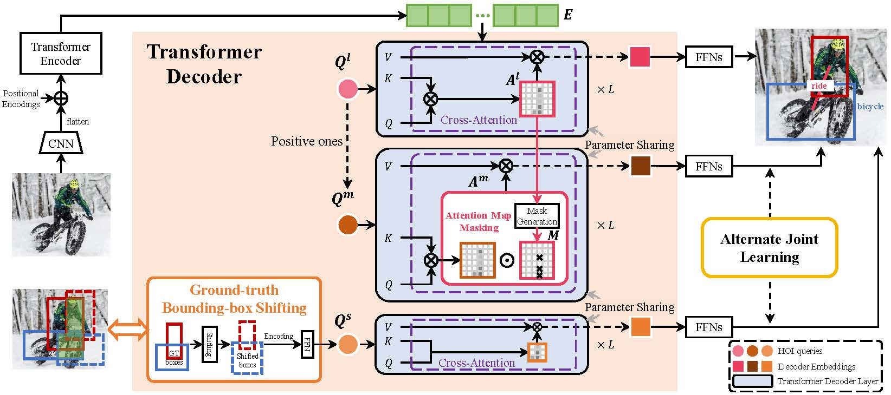

# Towards Hard-Positive Query Mining for DETR-based Human-Object Interaction Detection
by [Xubin Zhong](https://scholar.google.com/citations?user=Y_ZvaccAAAAJ&hl=zh-CN&oi=sra), [Changxing Ding](https://scholar.google.com/citations?user=8Z8jplgAAAAJ&hl=zh-CN), [Zijian Li](https://github.com/ionicbond-lzj) and [Shaoli Huang](https://scholar.google.com/citations?user=o31BPFsAAAAJ&hl=zh-CN).

This repository contains the official implementation of the paper "[Towards Hard-Positive Query Mining for DETR-based Human-Object Interaction Detection](https://arxiv.org/pdf/2207.05293.pdf)", which is accepted to **ECCV2022**.

<div align="center">
  
</div>

To the best of our knowledge, HQM is the first approach that promotes the robustness of DETR-based models from the perspective of hard example mining. Moreover, HQM is plug-and-play and can be readily applied to many DETR-based HOI detection methods.

## Preparation
Code is coming soon.

### Dependencies
Our implementation uses external libraries such as NumPy, PyTorch and 8 2080Ti GPUs.You can resolve the dependencies with the following command.
```
pip install numpy
pip install -r requirements.txt
```

### Dataset

#### HICO-DET
HICO-DET dataset can be downloaded [here](https://drive.google.com/open?id=1QZcJmGVlF9f4h-XLWe9Gkmnmj2z1gSnk). After finishing downloading, unpack the tarball (`hico_20160224_det.tar.gz`) to the `data` directory.

Instead of using the original annotations files, we use the annotation files provided by the PPDM authors. The annotation files can be downloaded from [here](https://drive.google.com/open?id=1WI-gsNLS-t0Kh8TVki1wXqc3y2Ow1f2R). The downloaded annotation files have to be placed as follows.
```
HQM
 |─ data
 │   └─ hico_20160224_det
 |       |─ annotations
 |       |   |─ trainval_hico.json
 |       |   |─ test_hico.json
 |       |   └─ corre_hico.npy
 :       :

 |─ params
 │   └─ detr-r50-pre.pth
```


### Pre-trained parameters
The annotations file and pre-trained weights can be downloaded [here](https://pan.baidu.com/s/11Fv-m-Y7ffhKhbyRj4iLVg) (pwd:1111)

## Evaluation
You can  conduct the evaluation with trained parameters as follows. The trained parameters are available [here](https://pan.baidu.com/s/13HUv_dsQncZIvQLAEuLavg) (pwd:1111).

```
python -m torch.distributed.launch \
    --nproc_per_node=8  \
    --use_env \
    main.py \
    --hoi \
    --dataset_file hico_gt \
    --model_name HQM \
    --hoi_path data/hico_20160224_det/ \
    --num_obj_classes 80 \
    --num_verb_classes 117 \
    --backbone resnet50 \
    --set_cost_bbox 2.5 \
    --set_cost_giou 1 \
    --bbox_loss_coef 2.5 \
    --giou_loss_coef 1 \
    --find_unused_parameters \
    --AJL \
    --eval \
    --resume params/checkpoint_best.pth
```

The results are like below:
```
"test_mAP": 0.313470564574163, "test_mAP rare": 0.26546478777620686, "test_mAP non-rare": 0.32780995244887723
```
`test_mAP`, `test_mAP rare`, and `test_mAP non-rare` are the results of the default full, rare, and non-rare setting, respectively.

## Results
HICO-DET.
|| Full (D) | Rare (D) | Non-rare (D) | Full(KO) | Rare (KO) | Non-rare (KO) |
| :--- | :---: | :---: | :---: | :---: | :---: | :---: |
|HOTR + HQM (ResNet50)| 25.69 | 24.70 | 25.98 |28.24| 27.35 | 28.51 |
|QPIC + HQM (ResNet50)| 31.34 | 26.54 | 32.78 | 34.09 | 29.63 | 35.42 |
|CDN-S + HQM (ResNet50)| 32.47 |28.15 | 33.76 | 35.17 |30.73 |36.50|

D: Default, KO: Known object

V-COCO.
|| Scenario 1 |
| :--- | :---: |
|ours (ResNet50)| 63.6 |

## Citation
Please consider citing our papers if it helps your research.
```
@inproceedings{zhong_eccv2022,
author = {Zhong, Xubin and Ding, Changxing and Li, Zijian and Huang, Shaoli},
title = {Towards Hard-Positive Query Mining for DETR-based Human-Object Interaction Detection},
booktitle={ECCV},
year = {2022},
}

@InProceedings{Qu_2022_CVPR,
    author    = {Qu, Xian and Ding, Changxing and Li, Xingao and Zhong, Xubin and Tao, Dacheng},
    title     = {Distillation Using Oracle Queries for Transformer-Based Human-Object Interaction Detection},
    booktitle = {Proceedings of the IEEE/CVF Conference on Computer Vision and Pattern Recognition (CVPR)},
    month     = {June},
    year      = {2022},
    pages     = {19558-19567}
}
```
## Acknowledgement
[DOQ](https://github.com/SherlockHolmes221/DOQ), [QPIC](https://github.com/hitachi-rd-cv/qpic) 
